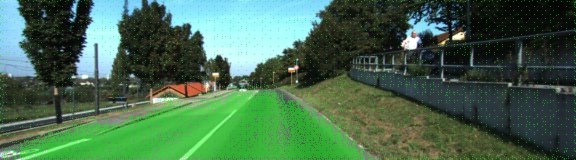

# Semantic Segmentation
### Introduction
In this project, you'll label the pixels of a road in images using a Fully Convolutional Network (FCN).

### Setup
##### GPU
`main.py` will check to make sure you are using GPU - if you don't have a GPU on your system, you can use AWS or another cloud computing platform.
##### Frameworks and Packages
Make sure you have the following is installed:
 - [Python 3](https://www.python.org/)
 - [TensorFlow](https://www.tensorflow.org/)
 - [NumPy](http://www.numpy.org/)
 - [SciPy](https://www.scipy.org/)

You may also need [Python Image Library (PIL)](https://pillow.readthedocs.io/) for SciPy's `imresize` function.

##### Dataset
Download the [Kitti Road dataset](http://www.cvlibs.net/datasets/kitti/eval_road.php) from [here](http://www.cvlibs.net/download.php?file=data_road.zip).  Extract the dataset in the `data` folder.  This will create the folder `data_road` with all the training a test images.

### Start
##### Implement
Implement the code in the `main.py` module indicated by the "TODO" comments.
The comments indicated with "OPTIONAL" tag are not required to complete.
##### Run
Run the following command to run the project:
```
python main.py
```
**Note:** If running this in Jupyter Notebook system messages, such as those regarding test status, may appear in the terminal rather than the notebook.

#### Example Outputs
Here are examples of a sufficient vs. insufficient output from a trained network:

Sufficient Result          |  Insufficient Result
:-------------------------:|:-------------------------:
  |  

### Submission
1. Ensure you've passed all the unit tests.
2. Ensure you pass all points on [the rubric](https://review.udacity.com/#!/rubrics/989/view).
3. Submit the following in a zip file.
 - `helper.py`
 - `main.py`
 - `project_tests.py`
 - Newest inference images from `runs` folder  (**all images from the most recent run**)

### Tips
- The link for the frozen `VGG16` model is hardcoded into `helper.py`.  The model can be found [here](https://s3-us-west-1.amazonaws.com/udacity-selfdrivingcar/vgg.zip).
- The model is not vanilla `VGG16`, but a fully convolutional version, which already contains the 1x1 convolutions to replace the fully connected layers. Please see this [post](https://s3-us-west-1.amazonaws.com/udacity-selfdrivingcar/forum_archive/Semantic_Segmentation_advice.pdf) for more information.  A summary of additional points, follow.
- The original FCN-8s was trained in stages. The authors later uploaded a version that was trained all at once to their GitHub repo.  The version in the GitHub repo has one important difference: The outputs of pooling layers 3 and 4 are scaled before they are fed into the 1x1 convolutions.  As a result, some students have found that the model learns much better with the scaling layers included. The model may not converge substantially faster, but may reach a higher IoU and accuracy.
- When adding l2-regularization, setting a regularizer in the arguments of the `tf.layers` is not enough. Regularization loss terms must be manually added to your loss function. otherwise regularization is not implemented.

### Why Layer 3, 4 and 7?
In `main.py`, you'll notice that layers 3, 4 and 7 of VGG16 are utilized in creating skip layers for a fully convolutional network. The reasons for this are contained in the paper [Fully Convolutional Networks for Semantic Segmentation](https://arxiv.org/pdf/1605.06211.pdf).

In section 4.3, and further under header "Skip Architectures for Segmentation" and Figure 3, they note these provided for 8x, 16x and 32x upsampling, respectively. Using each of these in their FCN-8s was the most effective architecture they found.

### Optional sections
Within `main.py`, there are a few optional sections you can also choose to implement, but are not required for the project.

1. Train and perform inference on the [Cityscapes Dataset](https://www.cityscapes-dataset.com/). Note that the `project_tests.py` is not currently set up to also unit test for this alternate dataset, and `helper.py` will also need alterations, along with changing `num_classes` and `input_shape` in `main.py`. Cityscapes is a much more extensive dataset, with segmentation of 30 different classes (compared to road vs. not road on KITTI) on either 5,000 finely annotated images or 20,000 coarsely annotated images.
2. Add image augmentation. You can use some of the augmentation techniques you may have used on Traffic Sign Classification or Behavioral Cloning, or look into additional methods for more robust training!
3. Apply the trained model to a video. This project only involves performing inference on a set of test images, but you can also try to utilize it on a full video.

### Using GitHub and Creating Effective READMEs
If you are unfamiliar with GitHub , Udacity has a brief [GitHub tutorial](http://blog.udacity.com/2015/06/a-beginners-git-github-tutorial.html) to get you started. Udacity also provides a more detailed free [course on git and GitHub](https://www.udacity.com/course/how-to-use-git-and-github--ud775).

To learn about REAMDE files and Markdown, Udacity provides a free [course on READMEs](https://www.udacity.com/courses/ud777), as well.

GitHub also provides a [tutorial](https://guides.github.com/features/mastering-markdown/) about creating Markdown files.

### Summary and notes:

#### 1. Used the network architecture mentioned in the lectures.

Layers | Explanation | Size
:------|:-----------:|:---:
a. conv_1x1_7 | 1x1 convolution of output of layer 7 | (1, 5, 18, 2)
b. conv_1x1_4 | 1x1 convolution of output of layer 4 | (1, 10, 36, 2)
c. conv_1x1_3 | 1x1 convolution of output of layer 3 | (1, 20, 72, 2)
d. decoder_1 | Upsample of conv_1x1_7 (k,s) = (4,2) | (1, 10, 36, 2)
e. decoder_1_skip | Addition of decoder_1 and conv_1x1_4 | (1, 10, 36, 2)
f. decoder_2 | Upsample of decoder_1_skip (k,s) = (4,2) | (1, 20, 72, 2)
g. decoder_2_skip | Addition of decoder_2 and conv_1x1_3 | (1, 20, 72, 2)
h. output | Upsample of decoder_2_skip (k,s) = (16,8)| (1, 160, 576, 2)

#### 2. Every 1x1 convolutional and upsample layer created use a random-normal kernel initializer with:
a. standard deviation 0.01 and
b. L2 kernel regularizer with L2 0.001

#### 3. Parameters related to the training defined at the beginning of script:

Parameter | Value
:------:|:---:
EPOCHS | 40
BATCH_SIZE | 10
LEARNING_RATE | 0.00001
DROPOUT | 0.5
WEIGHTS_INIT_SD | 0.01
WEIGHTS_REGU_L2 | 0.001

The above parameters can be further optimised. Somewhere between 25 and 30 epochs would probably be better given results.

#### 4. Results:

Epoch # | Loss
:------:|:---:
1/40 | 0.811861531488
2/40 | 0.419631271013
3/40 | 0.180849423696
4/40 | 0.133336106508
5/40 | 0.112586654466
6/40 | 0.101757068187
7/40 | 0.0984208576124
8/40 | 0.0821972977498
9/40 | 0.0703851005127
10/40 | 0.0653577273519
11/40 | 0.0604222591581
12/40 | 0.0562523584171
13/40 | 0.069746944411
14/40 | 0.0598256507053
15/40 | 0.0562863337069
16/40 | 0.0491829680215
17/40 | 0.046548365262
18/40 | 0.0453644089144
19/40 | 0.0440341152636
20/40 | 0.0411968186883
21/40 | 0.0404246590132
22/40 | 0.0374272072624
23/40 | 0.0361381193687
24/40 | 0.0354058058483
25/40 | 0.0351630325975
26/40 | 0.0348326773864
27/40 | 0.0324084469727
28/40 | 0.0319118039233
29/40 | 0.031349810033
30/40 | 0.0309145659979
31/40 | 0.0294413162588
32/40 | 0.028535173114
33/40 | 0.0331704569659
34/40 | 0.0315354289166
35/40 | 0.0282959993286
36/40 | 0.0271028634161
37/40 | 0.0259667487237
38/40 | 0.025545605362
39/40 | 0.025167161663
40/40 | 0.0253230448298

#### 5. References:

a. Used model, kernel_size (k) and stride (s) values discussed in Udacity lecture.

b. Weight regularisation has a large effect on the effectiveness of the network. This idea was inspired by https://github.com/darienmt/CarND-Semantic-Segmentation-P2.
